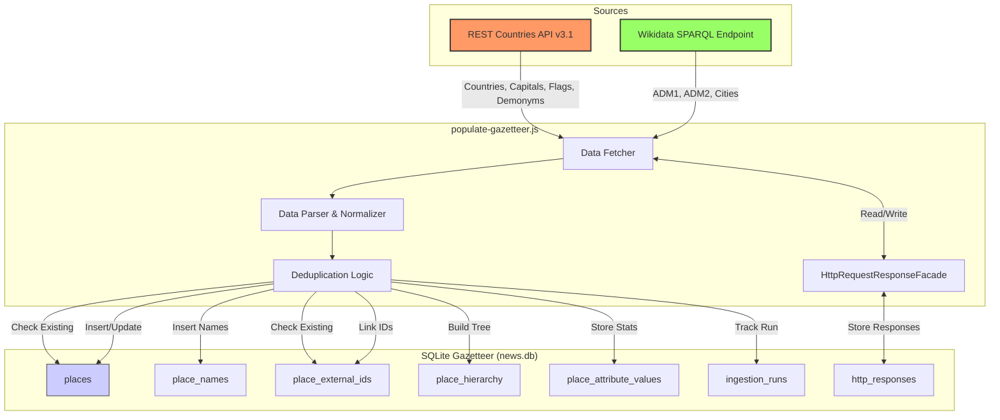

# Gazetteer Population Architecture

This document outlines the data flow and architecture for the `populate-gazetteer.js` tool, which seeds the local SQLite gazetteer.

## Data Flow Diagram

## Information Sources

### 1. REST Countries API (v3.1)
Primary source for top-level country data.
- **Entities:** Countries, Capital Cities.
- **Attributes:** Population, Area, Lat/Lng, Timezones, Region/Subregion.
- **Names:** Common, Official, Native (multi-lingual), Translations, Alt Spellings.
- **Metadata:** Flags, Maps, TLDs, Currencies, IDD codes.

### 2. Wikidata (SPARQL)
Secondary source for hierarchical depth.
- **Entities:**
    - **ADM1:** First-level administrative divisions (States, Provinces, Regions).
    - **ADM2:** Second-level administrative divisions (Counties, Districts).
    - **Cities:** Major cities (populated places).
- **Attributes:** Population, Coordinates, ISO 3166-2 codes.
- **Relationships:** Parent/Child hierarchy (City -> ADM2 -> ADM1 -> Country).

## Storage Strategy

The tool uses a "Deduplication First" approach:
1.  **External IDs:** Checks `place_external_ids` (e.g., `wikidata:Q123`, `restcountries:capital:GB:london`) to find existing records.
2.  **Updates:** If found, updates attributes and adds new names/aliases.
3.  **Inserts:** If not found, creates new `places` records.
4.  **Hierarchy:** Links places via `place_hierarchy` (e.g., `capital_of`, `admin_parent`).
