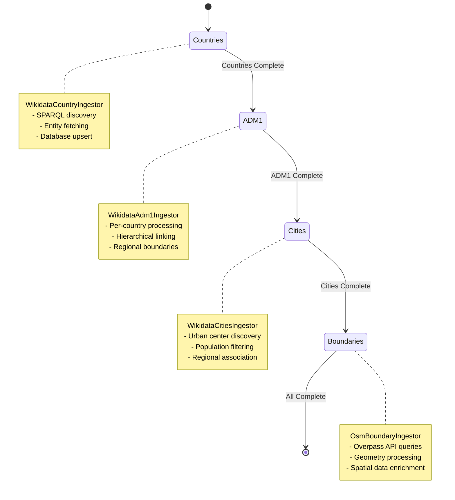

# Geography Crawl: Detailed Technical Report

## Overview

The geography crawl is a specialized mode in the copilot-dl-news system designed to ingest comprehensive geographic place data from external data sources rather than crawling traditional news websites. Unlike web crawls that fetch articles and follow hyperlinks, the geography crawl aggregates structured geographic information from Wikidata and OpenStreetMap to populate a gazetteer database with countries, administrative divisions, cities, and geographic boundaries.

### Key Characteristics

- **Data Sources**: Wikidata SPARQL endpoint and OpenStreetMap Overpass API
- **Storage**: Dedicated `places` and `place_attributes` tables in SQLite
- **Execution Model**: Breadth-first staged processing (countries → regions → cities → boundaries)
- **Concurrency**: Sequential processing due to API rate limits and data dependencies
- **Progress Tracking**: Real-time UI updates with stage-level completion metrics

## Architecture and Components

### Core Architecture

The geography crawl operates through a layered architecture:

1. **Entry Point**: `NewsCrawler` with `crawlType: 'geography'`
2. **Mode Controller**: `GazetteerModeController` orchestrates the entire process
3. **Ingestion Coordinator**: `GazetteerIngestionCoordinator` manages individual ingestors
4. **Stage Coordinator**: `StagedGazetteerCoordinator` enforces breadth-first stage ordering
5. **Priority Scheduler**: `GazetteerPriorityScheduler` tracks progress and enforces dependencies

### Data Flow Architecture

```mermaid
graph TD
    A[CLI/UI Request<br/>--crawl-type=geography] --> B[NewsCrawler.init()]
    B --> C[_configureGazetteerPipeline()]
    C --> D[StagedGazetteerCoordinator<br/>with stages]
    D --> E[GazetteerModeController.run()]
    E --> F[GazetteerIngestionCoordinator.execute()]
    F --> G[Sequential Stage Processing]
    G --> H[Countries Stage<br/>WikidataCountryIngestor]
    G --> I[ADM1 Stage<br/>WikidataAdm1Ingestor]
    G --> J[Cities Stage<br/>WikidataCitiesIngestor]
    G --> K[Boundaries Stage<br/>OsmBoundaryIngestor]
    H --> L[Database Upsert<br/>places + place_attributes]
    I --> L
    J --> L
    K --> L
```

## Tools and Ingestors

The geography crawl utilizes specialized ingestors, each designed for specific geographic data types and external APIs:

### 1. WikidataCountryIngestor

**Purpose**: Fetches comprehensive country data from Wikidata SPARQL endpoint

**Key Features**:
- **SPARQL Query**: Discovers all countries globally with basic metadata
- **Entity Fetching**: Retrieves full Wikidata entities for complete property sets
- **Comprehensive Properties**: Geographic coordinates, population, area, GDP, ISO codes, capital cities, official languages, currency, timezone, continent
- **Multilingual Support**: Labels and aliases in all available languages
- **Caching**: Database-backed caching (via `SQLiteNewsDatabase` adapter) for both SPARQL and Action API payloads
- **Rate Limiting**: 250ms delays between requests to respect Wikidata limits

**Data Properties Extracted**:
```javascript
{
  qid: "Q145", // Wikidata QID
  iso2: "GB", iso3: "GBR",
  population: 67500000,
  area: 243610, // km²
  gdp: 2829000000000, // USD
  capital: "Q23666", // London QID
  languages: ["Q1860", "Q7979"], // English, Welsh
  coordinates: { lat: 54.7023545, lon: -3.2765753 }
}
```

**Usage in Crawl**:
- Executed first in breadth-first sequence
- Provides foundation data for all subsequent stages
- Creates parent records for ADM1 divisions

### 2. WikidataAdm1Ingestor

**Purpose**: Ingests first-level administrative divisions (states, provinces, regions)

**Key Features**:
- **Parent-Child Relationships**: Links to parent countries from WikidataCountryIngestor
- **Hierarchical Processing**: Processes divisions for each country sequentially
- **Property Inheritance**: Inherits country-level metadata where applicable
- **Geographic Boundaries**: Attempts to fetch boundary geometries

**Usage in Crawl**:
- Depends on countries stage completion
- Processes ~50-100 divisions per country on average
- Enables city-to-region mapping in later stages

### 3. WikidataCitiesIngestor

**Purpose**: Populates major cities with population and geographic data

**Key Features**:
- **Population Thresholds**: Focuses on significant urban centers
- **Regional Association**: Links cities to their ADM1 parent divisions
- **Economic Indicators**: City-level GDP and economic data where available
- **Geographic Precision**: High-accuracy coordinates for mapping applications

**Usage in Crawl**:
- Final Wikidata-based stage
- Depends on ADM1 completion for proper hierarchical linking
- Provides urban geographic anchors for the gazetteer

### 4. OsmBoundaryIngestor

**Purpose**: Fetches geographic boundary geometries from OpenStreetMap Overpass API

**Key Features**:
- **Overpass API Integration**: Uses OSM's query API for boundary data
- **Geometry Processing**: Converts OSM relation data to GeoJSON boundaries
- **Batch Processing**: Handles multiple boundaries with configurable batch sizes
- **Fallback Handling**: Graceful degradation when boundary data unavailable
- **OSM Metadata**: Preserves OSM relation IDs and tags

**Usage in Crawl**:
- Final stage in the pipeline
- Processes places that have OSM identifiers
- Adds spatial geometry to existing place records

## How the Geography Crawl Uses Its Tools

### Sequential Stage Execution

The crawl enforces strict stage ordering to maintain data integrity:



### Data Processing Pipeline

Each ingestor follows a consistent pattern:

1. **API Query Construction**: Builds appropriate queries for Wikidata SPARQL or Overpass API
2. **Rate-Limited Execution**: Respects API limits with configurable delays
3. **Result Processing**: Parses JSON responses and extracts relevant properties
4. **Data Normalization**: Converts external formats to internal schema
5. **Database Upsert**: Uses prepared statements for efficient bulk operations
6. **Progress Emission**: Reports completion status for UI updates

### Database Integration

All ingestors use a shared data layer (`ingestQueries`) for database operations:

- **Prepared Statements**: Pre-compiled SQL for performance
- **Conflict Resolution**: Handles duplicate entries gracefully
- **Attribute Storage**: Flexible key-value storage for extended properties
- **Name Management**: Multi-lingual name storage with canonical name selection
- **External ID Mapping**: Links to Wikidata QIDs, OSM relation IDs, GeoNames IDs

## Performance Characteristics

### Current Performance Profile

- **Typical Runtime**: 5-10 minutes for full global dataset
- **API Limits**: Wikidata SPARQL (~60 req/min), Overpass API (varies by server)
- **Database Size**: ~50KB per country, ~5KB per administrative division
- **Memory Usage**: Minimal due to streaming processing
- **Network I/O**: Sequential API calls with rate limiting

### Bottlenecks

1. **API Rate Limits**: Sequential processing required by external service policies
2. **Database Transactions**: Individual upserts for each place entity
3. **SPARQL Query Complexity**: Broad discovery queries return large result sets
4. **Entity Fetching**: Individual HTTP requests for detailed Wikidata entities

## Optimization Playbook

The geography crawl already performs multi-stage ingestion reliably, but optimising it requires disciplined measurement, informed configuration, and targeted code changes. The playbook below provides an end-to-end approach that teams can apply incrementally.

### 1. Establish a Baseline and Instrumentation

- **Collect timing data**: Start with a full geography run and capture `progress` SSE messages plus the run summary written to `testlogs/`. Typical runtimes are 5–10 minutes for the global dataset.
- **Enable debug logging for hotspots**: Set `LOG_LEVEL=debug` before launching the crawl to expose cache hits, API retries, and stage transitions.
- **Record external quotas**: Wikidata SPARQL allows ~60 requests/minute; Overpass limits vary. Note observed HTTP status 429/503 events so later optimisations do not breach limits.
- **Snapshot database sizes**: Use `node tools/db-table-sizes.js` pre/post run to quantify insert throughput and content growth.

### 2. Leverage Database-Backed HTTP Caching

- **Use the adapter**: Pass the `SQLiteNewsDatabase` instance as `dbAdapter` when constructing `GazetteerModeController`. Without it, caching falls back to a no-op.
- **Verify cache inserts**: After a run, execute `SELECT COUNT(*) FROM http_responses WHERE api_endpoint IN ('wikidata-sparql','wikidata-wbgetentities');` to ensure responses are persisted.
- **Tune TTLs**: `cacheExpiryMs` on each ingestor defines freshness. A 30-day value balances API quotas with data freshness; shorten it for high-volatility stages (e.g., cities) and lengthen for stable data (countries).
- **Evict safely**: Use `dbAdapter.clearApiResponseCacheForUrls(...)` when a schema tweak invalidates cached payloads. This avoids blanket truncation of `http_responses`.

### 3. Batch External Requests

- **SPARQL batching**: The current query fetches all countries in one call. Maintain that behaviour but ensure the JSON payload is cached so subsequent runs skip the network entirely.
- **Entity batching**: Update `_fetchEntities` to chunk QIDs (Wikidata accepts up to 50 per request comfortably). Process sequentially within each chunk to respect rate limits. This reduces request count dramatically while retaining chronological control for progress logging.
- **Overpass batching**: For boundaries, group OSM relation IDs per country before calling the Overpass API. Respect the server’s recommended pause (typically 5–10 seconds) between batches.

### 4. Introduce Controlled Parallelism

- **Stage-level concurrency guard**: Keep the breadth-first sequencing intact, but within a stage schedule limited parallel workers (e.g., 2–3) driven by the existing `concurrency` setting.
- **Dependency-aware queues**: Partition work by parent entity (countries → ADM1 → cities). Never process a child until its parent record is committed.
- **Backoff strategy**: Combine exponential backoff with worker pausing when HTTP status 429 is encountered to prevent cascading failures.

### 5. Optimise Database Throughput

- **Explicit transactions**: Wrap bulk inserts inside `db.transaction(() => { ... })` in every ingestor. This cuts SQLite fsync overhead and ensures atomicity.
- **Prepared statement reuse**: Continue using `ingestQueries.createIngestionStatements` and pass the prepared handles into tight loops instead of re-preparing SQL for each record.
- **Normalized attribute writes**: Buffer `place_attributes` rows per place and execute in a single batch insert to minimise journal churn.
- **Analyze and vacuum periodically**: After large runs, schedule `node tools/vacuum-db.js` to keep B-tree statistics accurate and query plans efficient.

### 6. Support Incremental Updates

- **Track external timestamps**: Persist Wikidata `lastrevid` / `modified` fields or OSM `version` numbers in dedicated attribute columns.
- **Delta queries**: Modify SPARQL to filter on `wikibase:timestamp` so only entities updated since the last crawl are fetched.
- **Selective cache invalidation**: When detecting a changed entity, clear its cached HTTP responses (using URL-specific invalidation) before refetching.
- **Audit trail**: Store ingest run metadata (start/end timestamps, counts of new/updated places) in a separate table to support monitoring dashboards.

### 7. Configure Geographic Scope and Prioritization

- **Scoping options**: Extend `GazetteerModeController` to accept `regionFilters`, `countryAllowList`, or `populationThreshold` parameters. Feed them from the UI/API request to avoid code edits for ad-hoc runs.
- **Priority queue weighting**: Compute scores (e.g., population, GDP, strategic importance) and push them into `GazetteerPriorityScheduler`. Higher scores should bubble to the front of the queue so high-value geographies materialise first.
- **Depth controls**: Allow users to cap stages (e.g., stop at ADM1) for quicker exploratory runs.

### 8. Strengthen Monitoring and Regression Testing

- **Automated tests**: Expand `src/db/sqlite/v1/__tests__/api-cache.test.js` to cover geography-specific cache entries and expiry logic.
- **Smoke runs**: Add a quick geography smoke test to `tests/run-tests.js e2e-quick` that verifies caching hits and basic data integrity without ingesting the full dataset.
- **Run analyzers**: After each optimisation, execute `node tests/get-test-summary.js --compact` and `node tests/get-failing-tests.js` to confirm no regressions were introduced.
- **Telemetry hooks**: Emit stage duration metrics to the background task telemetry pipeline so successive runs can be compared easily.

## Implementation Priority Recommendations

### High Priority (Immediate Impact)
1. **Database-backed caching & TTL tuning** – Minimises repeat network traffic and respects API quotas
2. **Batched external requests** – Cuts HTTP chatter while leveraging existing caching infrastructure
3. **Transaction batching & stage-level concurrency** – Reduces SQLite overhead and shortens per-stage runtime

### Medium Priority (Significant Improvement)
4. **Incremental update mode** – Eliminates unnecessary full crawls and keeps data fresh
5. **Geographic scoping & prioritization** – Focuses resources on the most valuable regions first
6. **Boundary batching & Overpass pacing** – Stabilises the slowest stage without exceeding rate limits

### Lower Priority (Quality of Life)
7. **Advanced telemetry & predictive progress** – Improves visibility for operators
8. **Automated smoke coverage** – Adds quick regression checks for optimisation paths

## Conclusion

The geography crawl represents a sophisticated data ingestion pipeline that transforms external geographic data sources into a structured, queryable gazetteer database. While the current implementation is robust and functional, several optimization opportunities exist to improve efficiency, reduce resource consumption, and enhance user experience.

The suggested improvements focus on three main areas:
- **Performance**: Parallel processing, batching, and caching
- **Flexibility**: Configurable geographic scopes and incremental updates  
- **User Experience**: Better progress tracking and prioritization

Implementation of these suggestions would significantly enhance the crawl's efficiency while maintaining its reliability and data quality standards.</content>
<parameter name="filePath">c:\Users\james\Documents\repos\copilot-dl-news\geography-crawl-report.md