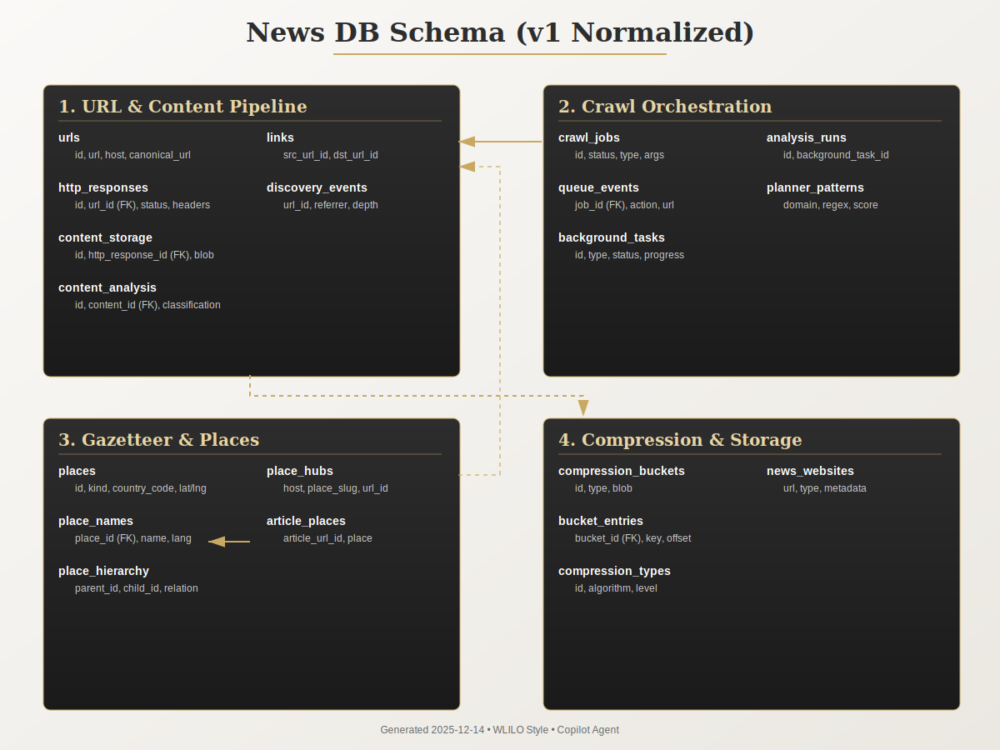

# Main SQLite Schema (`news.db`)

_Last snapshot: 2025-12-14 (`docs/database/_artifacts/news_db_stats.json`)_



## Quick Facts
- **Engine:** SQLite 3 (better-sqlite3 bindings) in WAL mode.
- **File size:** ~4.5 GB (`news_db_stats.json`).
- **Tables:** 79 (no materialized views); 215+ indexes; 25 triggers enforcing data integrity.
- **Views:** 3 compatibility layers (`articles_view`, `fetched_urls`, `place_hubs_with_urls`) bridging legacy consumers while Phase 4 normalization lands.
- **Dominant workloads:** crawler ingestion, URL normalization, place/gazetteer enrichment, coverage analytics, background task tracking.

## Schema Synchronization

**Always run after schema changes:**

```bash
npm run schema:sync     # Regenerate schema-definitions.js
npm run schema:check    # CI gate - exits 1 if drift detected
npm run schema:stats    # Regenerate with table statistics
```

**Canonical definitions:** `src/db/sqlite/v1/schema-definitions.js` (auto-generated)

### Row Count Highlights
| Table | Rows | Notes |
| --- | --- | --- |
| `links` | 4,874,880 | Graph of discovered hyperlinks; largest table. |
| `queue_events` | 1,670,293 | Historical queue actions; append-only. |
| `place_names` | 731,647 | Gazetteer names; major contributor to file size. |
| `urls` | 287,883 | Canonical URL catalog; foreign-key hub for most other tables. |
| `http_responses` | 60,480 | Raw fetch metadata; joined frequently with `content_storage` and `content_analysis`. |
| `content_storage` | 43,905 | Compressed payloads; references compression buckets when available. |
| `content_analysis` | 43,881 | Article classification/details derived from storage. |
| `discovery_events` | 39,044 | Tracks discovery metadata per URL. |
| `place_attribute_values` | 36,720 | Structured attributes per place. |
| `crawl_jobs` | 18,668 | PK `id`; links to `crawl_types`, `urls`. |

Full row counts are available in `news_db_stats.json` and should be consulted before large migrations.

## Logical Domains

### 1. URL & Content Pipeline
**Purpose:** Track URLs, fetches, normalized content, and relationships between pages.

- **Core tables:** `urls`, `http_responses`, `content_storage`, `content_analysis`, `links`, `discovery_events`, `url_aliases`.
- **Key relationships:**
  - `http_responses.url_id → urls.id`
  - `content_storage.http_response_id → http_responses.id`
  - `content_analysis.content_id → content_storage.id`
- **Important indexes:** `idx_http_responses_url`, `idx_content_storage_http_response`, `idx_content_analysis_content_classification`, `idx_urls_host`.
- **Triggers:**
  - `trg_urls_from_fetches_insert` (conceptually, though logic often lives in adapters now).
- **Operational guidance:**
  - Use the shared helper `src/db/sqlite/urlHelpers.js` to resolve URL IDs (ensures canonical row reuse).
  - Large bulk imports must stream writes (see migration exporter/importer for batching patterns).

### 2. Crawl Orchestration & Telemetry
**Purpose:** Record crawl jobs, queue state, planner stages, and background task orchestration.

- **Scheduling tables:** `crawl_jobs`, `crawl_tasks`, `crawl_types`, `crawler_settings`, `background_tasks`.
- **Queue telemetry:** `queue_events`, `queue_events_enhanced`, `problem_clusters`, `priority_config_changes`, `gap_predictions`.
- **Planner/analysis tracking:** `analysis_runs`, `analysis_run_events`, `planner_stage_events`, `planner_patterns`, `knowledge_reuse_events`.
- **Indexes to watch:** `idx_crawl_jobs_status_active`, `idx_queue_events_job_ts`, `idx_queue_events_enhanced_priority`, `idx_analysis_runs_status`.
- **Enhanced adapter:** `QueueDatabase`, `PlannerDatabase`, and `CoverageDatabase` wrap these tables; see adapter docs for API guarantees.
- **Backpressure signals:** `queue_events` grows quickly; archive by job ID when running analytics on cold data.

### 3. Coverage & Milestones
**Purpose:** Measure discovered hubs, coverage gaps, milestone achievements, and dashboard metrics.

- **Tables:** `coverage_snapshots`, `coverage_gaps`, `hub_discoveries`, `hub_validations`, `milestone_achievements`, `dashboard_metrics`.
- **Typical queries:** filtering by `job_id` and time ranges; indexes include `idx_coverage_snapshots_job_time`, `idx_hub_discoveries_job_discovered`, `idx_milestone_achievements_job_achieved`.
- **Data volume:** currently sparse (0–few rows) because the enhanced adapter is optional; safe to backfill in tests without large footprints.

### 4. Gazetteer & Place Intelligence
**Purpose:** Maintain the global place hierarchy, attributes, and crawl mappings.

- **Entity tables:** `places`, `place_names`, `place_attribute_values`, `place_attributes`, `place_external_ids`, `place_hierarchy`.
- **Hub linkage:** `place_hubs`, `place_hub_candidates`, `place_page_mappings`, `place_hub_unknown_terms`, `place_hub_audit`.
- **Indexes:** Many composite indexes to support lookups by slug, language, relation, and status. See `news_db_schema.sql` lines covering `idx_place_*` and `idx_place_hub_*` families.
- **Triggers:** Extensive validation on `places` and `place_names` (no empty names, enforce country codes, prevent hierarchy cycles).
- **Storage size:** `place_names` and `place_attribute_values` dominate the gazetteer footprint; plan migrations accordingly.

### 5. Compression & Storage Buckets
**Purpose:** Store compressed content and summarise bucket statistics.

- **Tables:** `compression_types`, `compression_buckets`, `bucket_entries`, `compression_status`, `news_websites`, `news_websites_stats_cache`.
- **Usage pattern:** `content_storage` references `compression_buckets` and `compression_types`. Buckets remain empty today (0 rows) but the schema is production-ready.
- **Care points:** Keep `compression_types` seeded via `seeders.js`; bucket blobs can grow large—monitor file size when enabling Brotli tiers.

### 6. Supporting Reference Data
- `domains`, `domain_categories`, `domain_category_map`, `domain_locales`: domain taxonomy & localization metadata.
- `topic_keywords`, `non_geo_topic_slugs`: thematic tagging for queue prioritisation.
- `schema_metadata`, `schema_migrations`: schema fingerprinting and migration journal.
- `query_telemetry`: aggregated query performance metrics generated via `wrapWithTelemetry`.
- `gazetteer_crawl_state`, `ingestion_runs`: long-running task bookkeeping.

## Table Reference (Alphabetical)
> Use this as a quick lookup; counts mirror `news_db_stats.json`.

| Table | Category | Rows | Primary Keys & Key Constraints |
| --- | --- | --- | --- |
| `analysis_run_events` | Planner/Analytics | 634 | FK to `analysis_runs`; ordered by `(run_id, ts)`.
| `analysis_runs` | Planner/Analytics | 91 | PK `id`; optional link to `background_tasks`.
| `article_place_relations` | Gazetteer | 2 | Links analyzed article fetches to `places` with unique `(article_id, place_id, matching_rule_level)`.
| `article_places` | Gazetteer | 9,808 | Normalized place mentions keyed by `article_url_id`.
| `article_xpath_patterns` | Coverage/Extraction | 1 | Learned article extraction rules per domain.
| `background_tasks` | Operations | 66 | Tracks CLI/background workflows.
| `bucket_entries` | Compression | 0 | Child rows for `compression_buckets`.
| `compression_buckets` | Compression | 0 | Bucket metadata; optional blob storage.
| `compression_status` | Compression | 1 | Singleton summary row (PK enforced via `CHECK id = 1`).
| `compression_types` | Compression | 18 | Catalog of supported compression presets.
| `content_analysis` | Content | 43,881 | Derived analysis per fetch; indexed by classification.
| `content_storage` | Content | 43,905 | Raw blobs or bucket references per fetch.
| `coverage_gaps` | Coverage | 0 | Pending coverage issues; unique per `(job_id, gap_type, gap_identifier)`.
| `coverage_snapshots` | Coverage | 0 | Time-series metrics per job/domain.
| `crawl_jobs` | Crawl Orchestration | 18,668 | PK `id`; links to `crawl_types`, `urls`.
| `crawl_milestones` | Crawl Orchestration | 3,952 | Events generated by crawler milestone telemetry.
| `crawl_problems` | Crawl Orchestration | 176 | Problem log per crawl job.
| `crawl_skip_terms` | Crawl Orchestration | 55 | Normalized stop-terms with unique `(lang, normalized)`.
| `crawl_tasks` | Crawl Orchestration | 0 | Pending queue tasks; historically pruned.
| `crawl_types` | Crawl Orchestration | 8 | Seeded via `seedCrawlTypes`.
| `crawler_settings` | Crawl Orchestration | 0 | Key/value overrides for crawler behaviour.
| `cross_crawl_knowledge` | Planner | 0 | Knowledge transfer store.
| `dashboard_metrics` | Coverage | 0 | Real-time metrics per job.
| `discovery_events` | Content | 39,044 | Tracks discovery metadata per URL.
| `domain_categories` | Reference | 1 | Domain tagging taxonomy.
| `domain_category_map` | Reference | 1 | Many-to-many linking table.
| `domain_locales` | Reference | 0 | Domain locale detection cache.
| `domains` | Reference | 11 | Unique domains touched by crawler.
| `errors` | Crawl | 4,028 | Errors encountered during crawl operations.
| `gap_predictions` | Coverage | 0 | Predicted high-value URLs.
| `gazetteer_crawl_state` | Gazetteer Ops | 4 | Stage/progress tracker for gazetteer ingestion.
| `http_responses` | Content | 60,480 | Core record for each HTTP fetch response.
| `hub_discoveries` | Coverage | 0 | Documented coverage wins (hub URLs).
| `hub_validations` | Coverage | 0 | Quality gating for hub candidates.
| `ingestion_runs` | Ops | 9 | Tracks bulk ingestion jobs.
| `knowledge_reuse_events` | Planner | 0 | Instances where stored patterns saved time.
| `layout_signatures` | Content | 30 | Layout fingerprints for page classification.
| `links` | Content | 4,874,880 | Dense hyperlink graph; caution when scanning.
| `milestone_achievements` | Coverage | 0 | Snapshots of milestone completions.
| `news_websites` | Compression | 36 | Domain-level metadata for compression.
| `news_websites_stats_cache` | Compression | 0 | Aggregated stats per `news_websites` row.
| `non_geo_topic_slugs` | Reference | 12 | Manually curated topic slugs.
| `page_categories` | Content | 5 | Classification labels for pages.
| `page_category_map` | Content | 0 | Join table `fetches ↔ page_categories`.
| `place_attribute_values` | Gazetteer | 36,720 | JSON attributes per source.
| `place_attributes` | Gazetteer | 0 | Alternative attribute store (new schema).
| `place_external_ids` | Gazetteer | 15,139 | Crosswalk to external datasets.
| `place_hierarchy` | Gazetteer | 10,369 | Parent-child relationships; guarded by triggers.
| `place_hub_audit` | Gazetteer | 0 | Audit log for hub decisions.
| `place_hub_candidates` | Gazetteer | 406 | Candidate hubs with scores.
| `place_hub_determinations` | Gazetteer | 2 | Final hub determinations.
| `place_hub_guess_runs` | Gazetteer Ops | 0 | Batch-run metadata for hub discovery.
| `place_hub_unknown_terms` | Gazetteer | 4,285 | Terms not mapped to places yet.
| `place_hubs` | Gazetteer | 97 | Effective hub assignments per host.
| `place_names` | Gazetteer | 731,647 | Localized names; rely on indexes for performance.
| `place_page_mappings` | Gazetteer | 54 | Maps places to actual hub URLs.
| `place_provenance` | Gazetteer | 0 | Detailed provenance records (future use).
| `place_sources` | Gazetteer | 3 | Source catalog for places ingestion.
| `places` | Gazetteer | 13,688 | Core place dimension table.
| `planner_patterns` | Planner | 0 | Learned patterns by domain.
| `planner_stage_events` | Planner | 0 | Stage-level telemetry (future use).
| `priority_config_changes` | Queue | 0 | Audit log for priority tuning.
| `problem_clusters` | Queue | 0 | Aggregated queue problems.
| `query_telemetry` | Ops | 471 | Query timing statistics.
| `queue_events` | Queue | 1,670,293 | Legacy queue log; heavy analytic workload.
| `queue_events_enhanced` | Queue | 0 | Enhanced queue log with URL IDs.
| `schema_metadata` | Ops | 1 | Stores last schema fingerprint hash.
| `schema_migrations` | Ops | 8 | Migration journal.
| `topic_keywords` | Reference | 73 | Keywords per topic/language.
| `ui_cached_metrics` | Ops | 4 | Cached UI metrics.
| `url_aliases` | Content | 9,850 | URL ↔ alias mapping for dedupe & coverage.
| `url_categories` | Reference | 0 | Category vocabulary.
| `url_category_map` | Reference | 0 | Join table for future use.
| `url_classification_patterns` | Content | 1,811 | Regex patterns for URL classification.
| `url_classifications` | Content | 0 | Per-URL classification results.
| `urls` | Content | 287,883 | Canonical URL registry.

(Any tables not listed above are internal SQLite constructs or deprecated scratch tables.)

## View Reference
| View | Purpose | Notes |
| --- | --- | --- |
| `articles_view` | Backfills the legacy `articles` table shape (metadata only) for analytics/tests that still expect denormalized columns. | Joins URL, response, storage, analysis, and discovery metadata while intentionally omitting `html`/`text`/`compressed_html`. Consumers must fetch blobs through the storage adapter and decompress before doing any content-level work.
| `fetched_urls` | Provides a summary of fetch history per URL. | Aggregates `http_responses` to show first/last fetch times and counts.
| `place_hubs_with_urls` | Provides canonical URL strings alongside `place_hubs` metadata for CLI/services that seed crawls from known hubs. | Hosts inherit from `place_hubs`, `url` comes from the joined `urls` row.

## Trigger Inventory
| Trigger | Target | Purpose |
| --- | --- | --- |
| `trg_place_hierarchy_no_cycle_*` | `place_hierarchy` | Prevents cycles or self-references in the hierarchy graph. |
| `trg_place_names_nonempty_*` | `place_names` | Disallows blank names. |
| `trg_places_*` series | `places` | Enforces country code, latitude/longitude, status constraints. |
| `trg_place_names_delete_clear_canonical` | `place_names` | Clears `places.canonical_name_id` if the canonical name is removed. |

Refer to `src/db/sqlite/v1/schema-definitions.js` for the full list and SQL definitions.

## Maintenance Tips
- **Vacuum cadence:** Run `node tools/vacuum-db.js` (or manual `VACUUM;`) monthly or after large deletes. Keep in sync with WAL checkpoint SLO above.
- **Index review:** High-velocity tables (`links`, `queue_events`) rely on their composite indexes for reporting. Before dropping indexes, analyse `query_telemetry` for actual impact.
- **Migration staging:** Use `tools/migration-cli.js migrate` with a temp copy (e.g., `migration-temp/news-migrated.db`) before touching production data.
- **Row count monitoring:** The stats artifact is regenerated whenever the docs are refreshed. Recompute after bulk imports to spot anomalies early.

## Known Gaps
- Enhanced adapter tables (`coverage_*`, `hub_*`, `planner_*`) are mostly empty; confirm planned rollouts populate them before removing indexes.
- URL normalization migrations are mid-flight (`src/db/migrations/url-normalization-schema.sql`); expect additional foreign keys to appear soon.
- Production schema drift has not been assessed—see `_artifacts/schema_drift.md` for follow-up actions.
