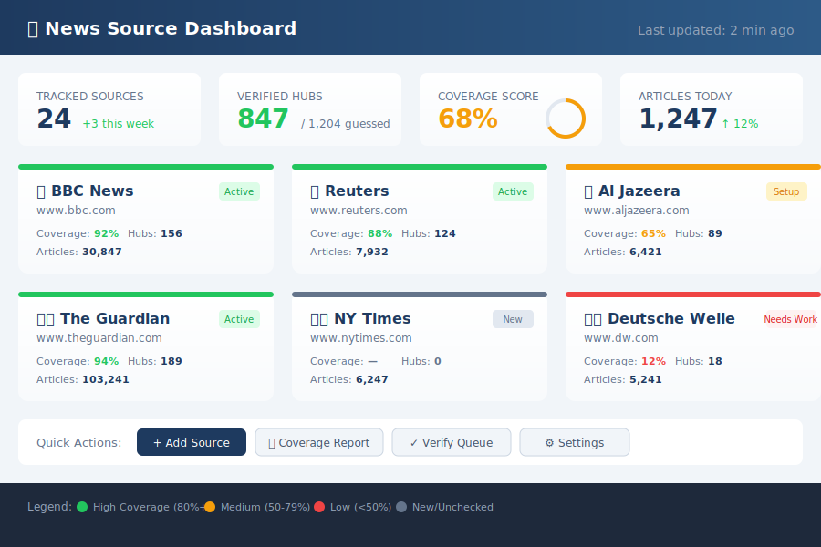
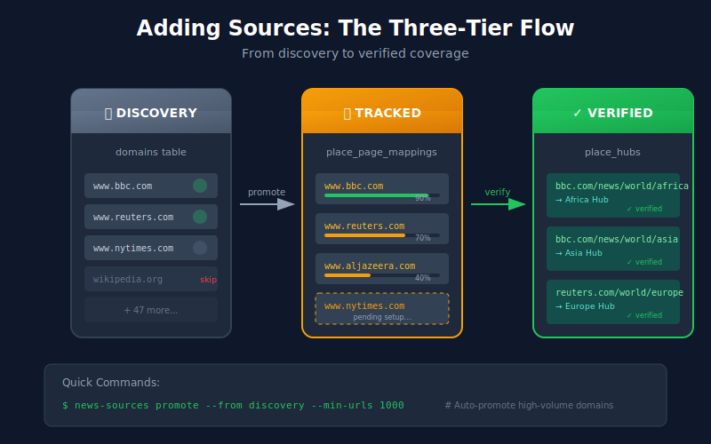
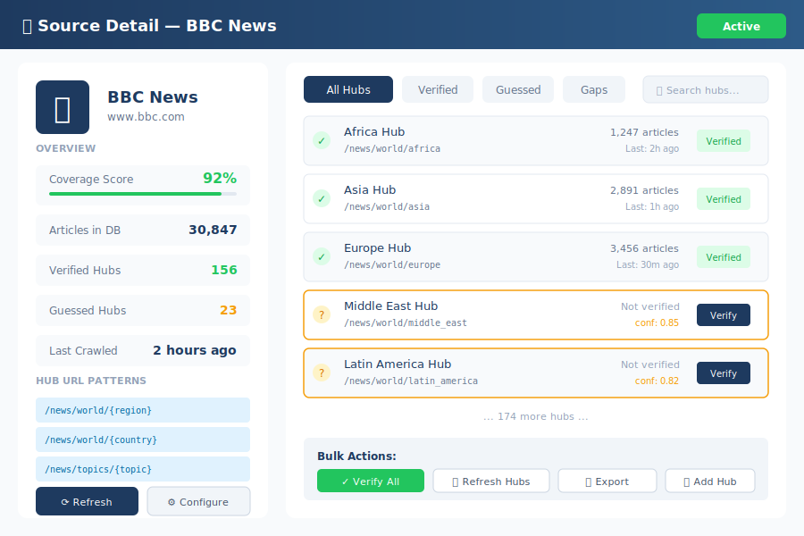
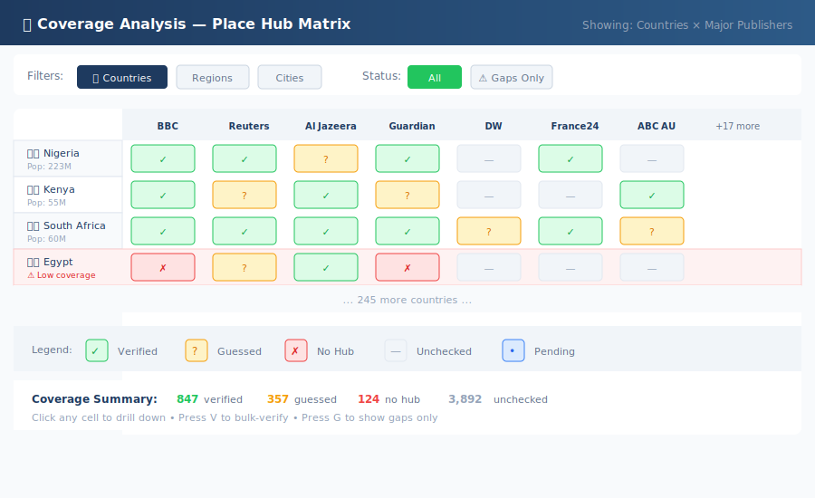

# Chapter 25: Organizing News Sources

> A practical guide to adding, managing, and analyzing news sources in the place hub system.

## The Vision

A well-organized news source system should make it **trivially easy** to:

1. **Add** new publishers with a single command or click
2. **View** coverage gaps at a glance
3. **Analyze** which sources cover which places
4. **Track** hub verification status across all sources



---

## Part 1: Adding News Sources

### The Three-Tier Model

News sources flow through three tiers:

| Tier | Table | Purpose |
|------|-------|---------|
| **Discovery** | `domains` | Hosts we've seen during crawls |
| **Tracked** | `place_page_mappings` | Hosts we're actively monitoring for place hubs |
| **Verified** | `place_hubs` | Confirmed hub URLs with structure |

### Quick Add: Single Command

```bash
# Add a news source to tracking
node tools/news-sources.js add www.bbc.com --tier tracked

# Add multiple at once
node tools/news-sources.js add www.reuters.com www.aljazeera.com www.nytimes.com
```

### Bulk Import: From Discovery

```bash
# Promote top 20 discovered domains to tracked
node tools/news-sources.js promote --from discovery --limit 20 --min-urls 1000

# Filter by region focus
node tools/news-sources.js promote --from discovery --region europe --limit 10
```

### Configuration File

```yaml
# config/news-sources.yaml
sources:
  - host: www.bbc.com
    name: BBC News
    tier: tracked
    regions: [uk, world]
    languages: [en]
    hub_patterns:
      - /news/{region}
      - /news/world/{country}

  - host: www.lemonde.fr
    name: Le Monde
    tier: tracked
    regions: [france, world]
    languages: [fr]
    hub_patterns:
      - /international/{region}
```



---

## Part 2: The Source Dashboard

### At-a-Glance Metrics

Each source card shows:

- **Coverage Score**: % of target places with verified hubs
- **Last Crawled**: When we last fetched from this source
- **Article Count**: Total articles in database
- **Hub Status**: Verified / Guessed / Unknown counts

### Filtering & Search

Quick filters:
- 🌍 **By Region**: Show sources covering specific regions
- 📊 **By Coverage**: Sort by coverage percentage
- ⚠️ **Needs Attention**: Sources with low verification rates
- 🆕 **Recently Added**: New sources needing setup



---

## Part 3: Coverage Analysis

### The Coverage Matrix

The matrix shows **places × sources** with color-coded cells:

| Cell Color | Meaning |
|------------|---------|
| ⬜ Gray | Unchecked — no data yet |
| 🟡 Yellow | Guessed — URL pattern detected |
| 🟠 Orange | Pending — verification in progress |
| 🟢 Green | Verified — confirmed hub exists |
| 🔴 Red | Verified absent — no hub for this place |

### Gap Analysis

The system identifies:

1. **High-Priority Gaps**: Major countries with no verified hubs
2. **Source Opportunities**: Publishers likely to have hubs (based on patterns)
3. **Verification Queue**: Guessed hubs ready for verification

```bash
# Show coverage gaps for a region
node tools/coverage-analysis.js gaps --region africa --min-population 10000000

# Suggest sources for a place
node tools/coverage-analysis.js suggest-sources --place nigeria
```



---

## Part 4: Verification Workflow

### Automatic Hub Detection

The system guesses hub URLs using:

1. **URL Patterns**: `/world/africa`, `/news/nigeria`
2. **Sitemap Analysis**: Scan sitemaps for place-like URLs
3. **Content Analysis**: Find articles mentioning places

### Manual Verification

For each guessed hub:

1. **Preview**: Show the guessed URL
2. **Verify**: Confirm it's a real hub page
3. **Enrich**: Add metadata (article selectors, update frequency)

### Bulk Verification

```bash
# Verify all guessed hubs for a source
node tools/hub-verify.js bulk --host www.bbc.com --dry-run

# Auto-verify with confidence threshold
node tools/hub-verify.js auto --confidence 0.9 --limit 100
```


---

## Part 5: Source Health Monitoring

### Health Indicators

| Indicator | Good | Warning | Critical |
|-----------|------|---------|----------|
| Last Crawl | < 24h | 1-7 days | > 7 days |
| Success Rate | > 95% | 80-95% | < 80% |
| New Articles/Day | > 10 | 1-10 | 0 |
| Hub Freshness | < 1 week | 1-4 weeks | > 1 month |

### Alerting

Configure alerts for:
- Source goes offline
- Hub structure changes
- Coverage drops significantly

---

## Quick Reference

### CLI Commands

```bash
# Source management
news-sources list                    # List all tracked sources
news-sources add <host>              # Add a new source
news-sources remove <host>           # Remove a source
news-sources info <host>             # Show source details

# Coverage analysis
coverage-analysis matrix             # Show full matrix
coverage-analysis gaps               # Show coverage gaps
coverage-analysis report             # Generate coverage report

# Hub verification
hub-verify check <url>               # Check single URL
hub-verify bulk --host <host>        # Bulk verify for host
hub-verify status                    # Show verification queue
```

### UI Navigation

| Page | URL | Purpose |
|------|-----|---------|
| Dashboard | `/admin/sources` | Overview of all sources |
| Matrix | `/admin/place-hubs` | Coverage matrix |
| Source Detail | `/admin/sources/:host` | Single source deep-dive |
| Verification | `/admin/verify` | Hub verification queue |

---

## Summary

A well-organized news source system is built on:

1. **Clear tiers**: Discovery → Tracked → Verified
2. **Easy addition**: Single command or config file
3. **Visual analysis**: Matrix and dashboard views
4. **Systematic verification**: From guess to confirmed
5. **Health monitoring**: Keep sources fresh and working

The goal is **minimum friction** for adding sources and **maximum visibility** into coverage status.
