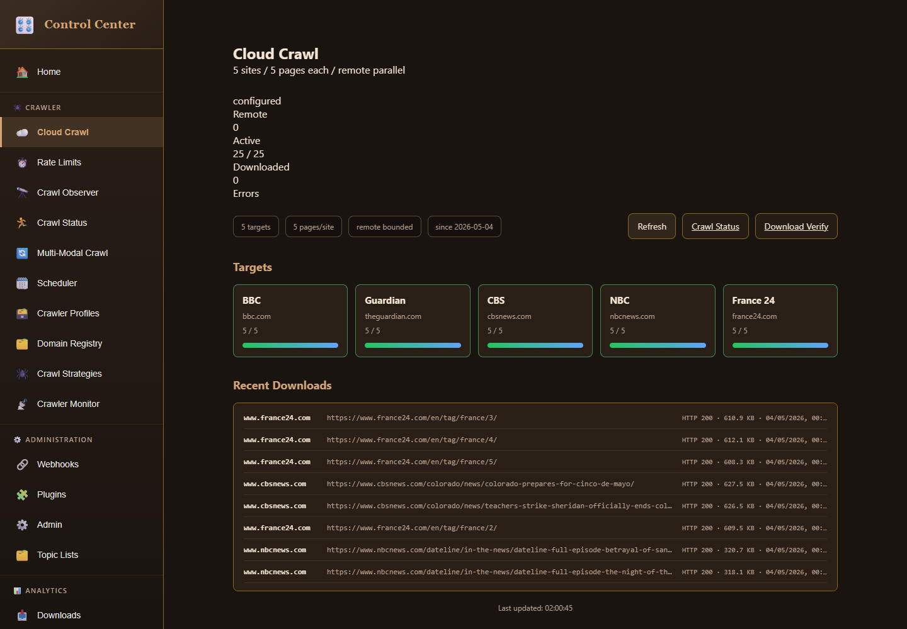
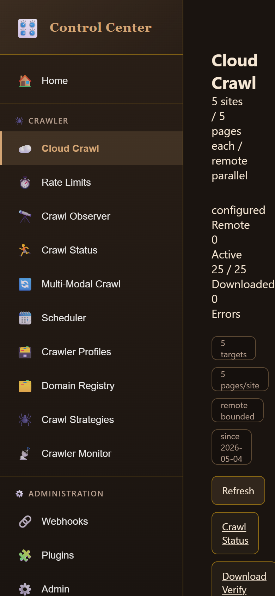
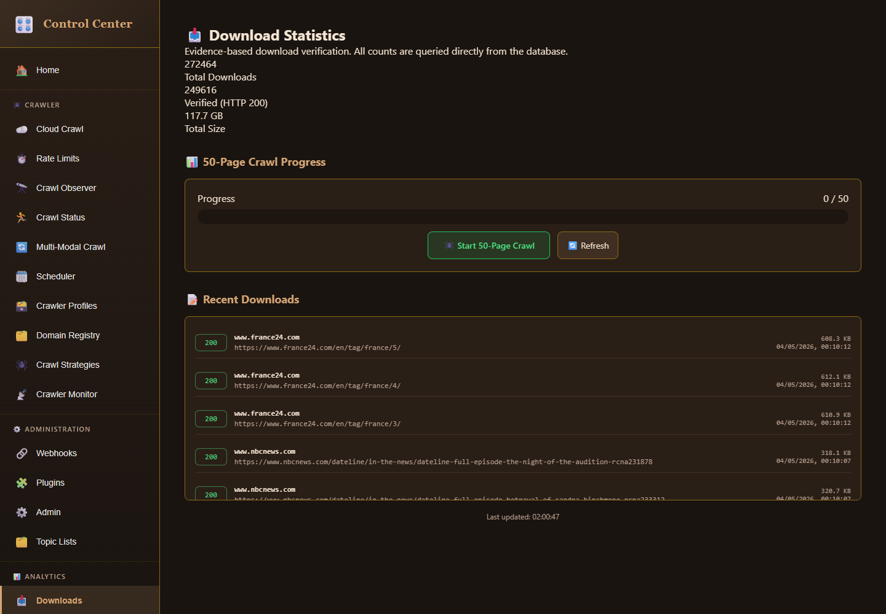
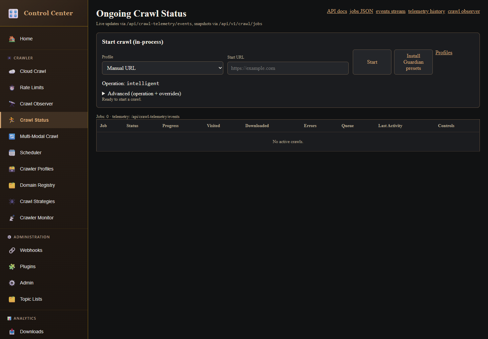
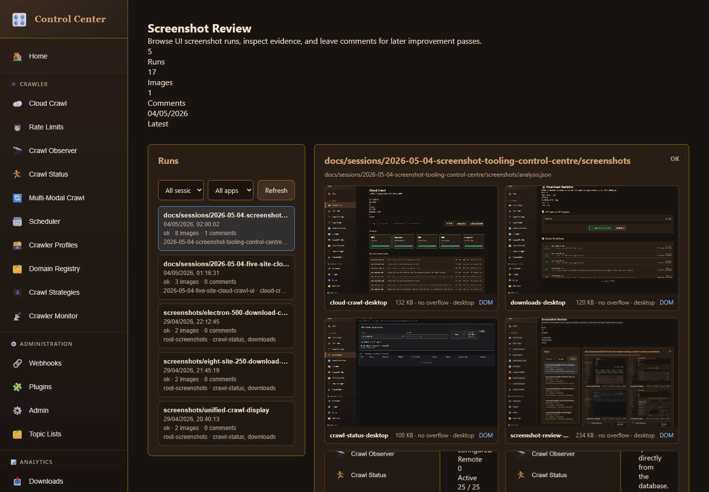
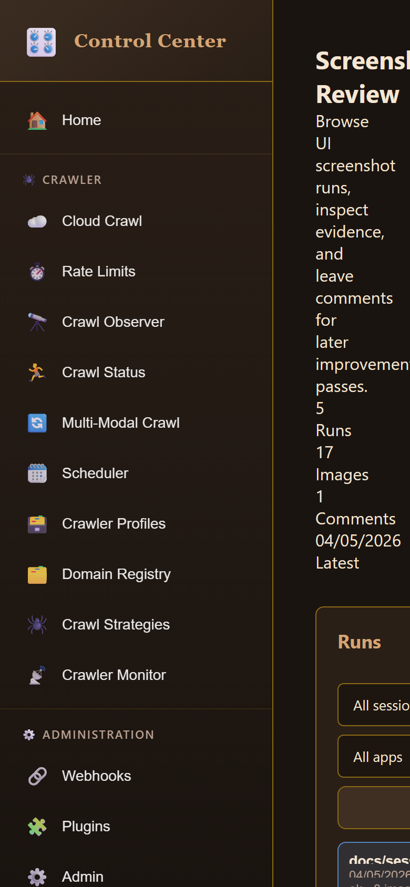

# Screenshot Review: Screenshot Tooling Control Centre

Artifacts live in `screenshots/` and are discoverable from the Control Center at `/?app=screenshot-review`.

## Crawl UI Specification Review

The saved evidence is now strong enough to assess the crawl UI against the earlier specification for a minimal, highly functional view of recent crawl progress.

What it proves:
- `cloud-crawl-desktop` and `cloud-crawl-mobile` both load the Control Center Cloud Crawl panel with no horizontal overflow.
- Both viewports show the essential crawl state in metrics: remote configured, active jobs `0`, downloaded `25 / 25`, errors `0`.
- No stuck loading text or iframe loading leftovers were detected.
- DOM snapshots were saved next to both PNGs, so a later pass can inspect exact rendered markup without reopening a browser.

Judgement: the Cloud Crawl panel meets the minimal/high-functionality requirement at the evidence level we can automate: concise status, recent crawl success count, zero errors, and target/download sections are present without layout overflow on desktop or mobile. The only caveat is that richer per-download detail should stay secondary; the current approach of keeping details in lower sections, and later hiding more detail behind icon-triggered dialogs if needed, fits the requested direction.

## Journey: Cloud Crawl Desktop

Goal: confirm the prior five-site cloud crawl UI still renders after the shared capture refactor.

Evidence: `analysis.json` route `cloud-crawl-desktop` reports `downloaded=25 / 25`, no horizontal overflow, no iframe loading leftovers, DOM snapshot saved, and a 134825 byte PNG.

## Journey: Cloud Crawl Mobile

Goal: confirm the compact crawl UI remains responsive at a phone viewport.

Evidence: `analysis.json` route `cloud-crawl-mobile` reports viewport `390x844`, `downloaded=25 / 25`, no horizontal overflow, no loading leftovers, DOM snapshot saved, and a 222110 byte PNG.

## Journey: Downloads

Goal: confirm an existing unified panel remains screenshot-capable through the shared helper.

Evidence: `analysis.json` route `downloads-desktop` reports active nav `Downloads`, no horizontal overflow, DOM snapshot saved, and a 123298 byte PNG.

## Journey: Crawl Status

Goal: confirm iframe-backed unified panels still load correctly during route capture.

Evidence: `analysis.json` route `crawl-status-desktop` found iframe text including `Manual URL` and `No active crawls.`, with no loading leftovers, DOM snapshot saved, and a 101890 byte PNG.

## Journey: Screenshot Review

Goal: inspect the new screenshot viewer inside the Control Center.

Evidence: `analysis.json` routes `screenshot-review-desktop` and `screenshot-review-mobile` report active nav `Screenshots`, no horizontal overflow, no loading leftovers, DOM snapshot links present in the rendered page, and PNGs of 244097 and 216712 bytes.

Visual judgement: the panel is intentionally basic and dense. Session/app filters keep the run list manageable as artifacts grow, image cards include viewport labels, and each saved route has a DOM link for fast debugging.