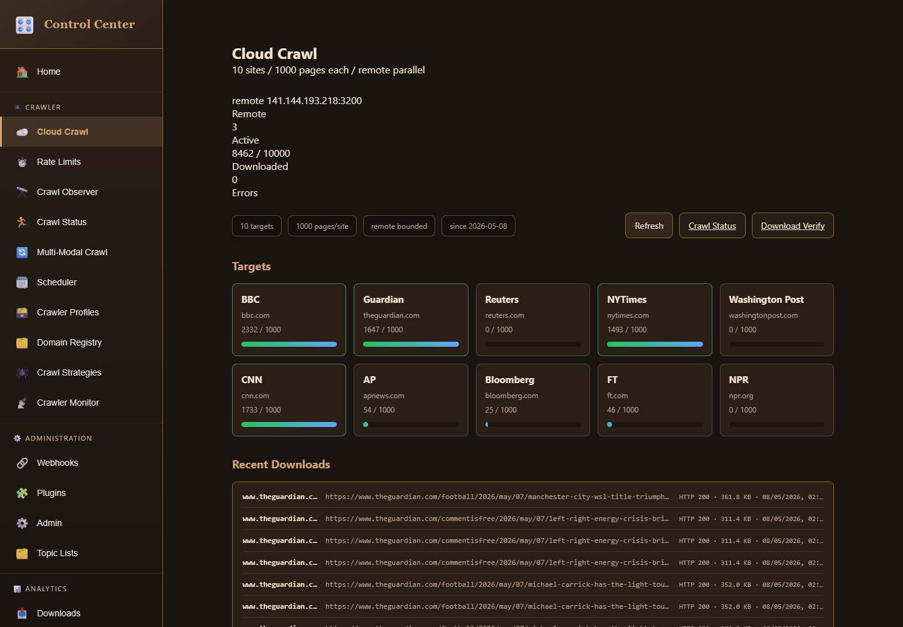
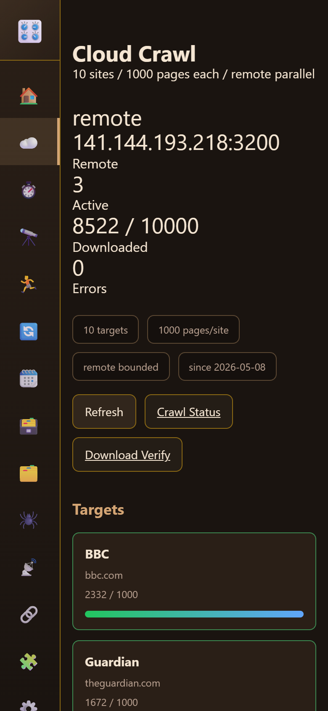

# Screenshot Review: Electron Cloud Crawl 10x1000

Captured with:

```powershell
C:\nvm4w\nodejs\node.exe scripts\ui\capture-unified-crawl-display.js --base-url http://127.0.0.1:3170 --output docs\sessions\2026-05-08-electron-crawl-10x1000\screenshots --save-screenshots --save-dom-snapshots
```

Artifact set:
- `screenshots/analysis.json`
- `screenshots/cloud-crawl-desktop.png`
- `screenshots/cloud-crawl-mobile.png`
- DOM snapshots for every captured route.

## Final Cloud Crawl Evidence





Final capture summary:
- `analysis.json` reported `ok: true`.
- Desktop Cloud Crawl: remote `141.144.193.218:3200`, `3` active jobs, `8462 / 10000` downloaded, `0` errors.
- Mobile Cloud Crawl: remote `141.144.193.218:3200`, `3` active jobs, `8522 / 10000` downloaded, `0` errors.
- Desktop and mobile reported `horizontalOverflow: false` and `emptyStates: 0`.
- Download totals increased during the capture run: desktop `280905` total downloads, mobile `280964` total downloads.

Visual review:
- The operator view clearly shows the active remote host, active job count, total progress, target cards, and recent downloads.
- The mobile view is tall but coherent: metrics remain readable, controls wrap cleanly, and target cards retain stable width without overflow.
- No loading states, empty states, or route failures were visible in the final capture.
