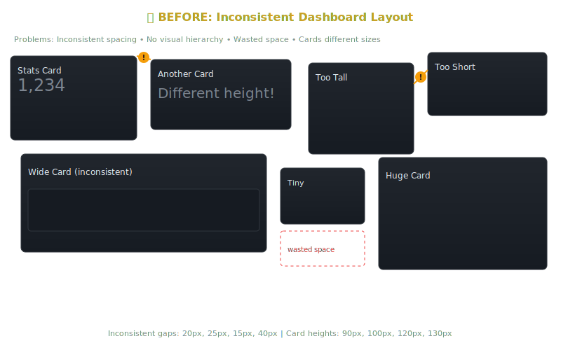
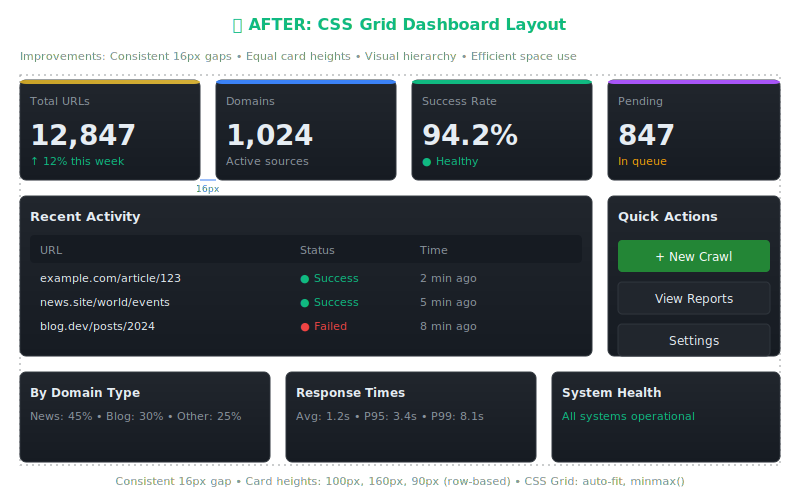
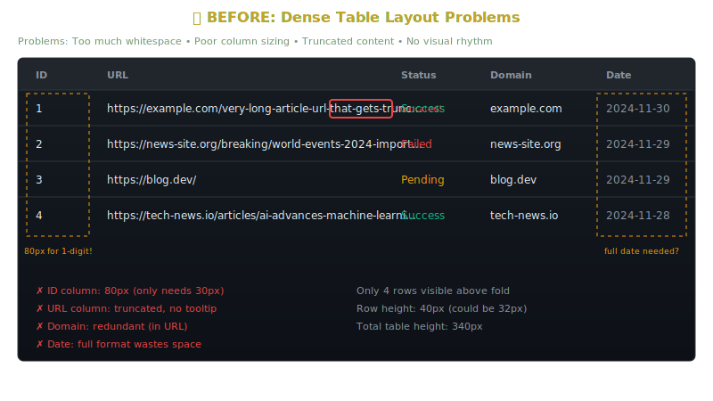
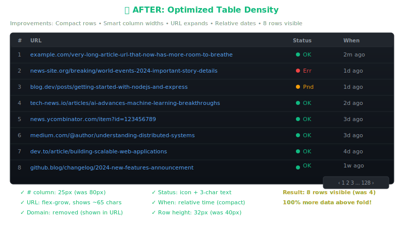
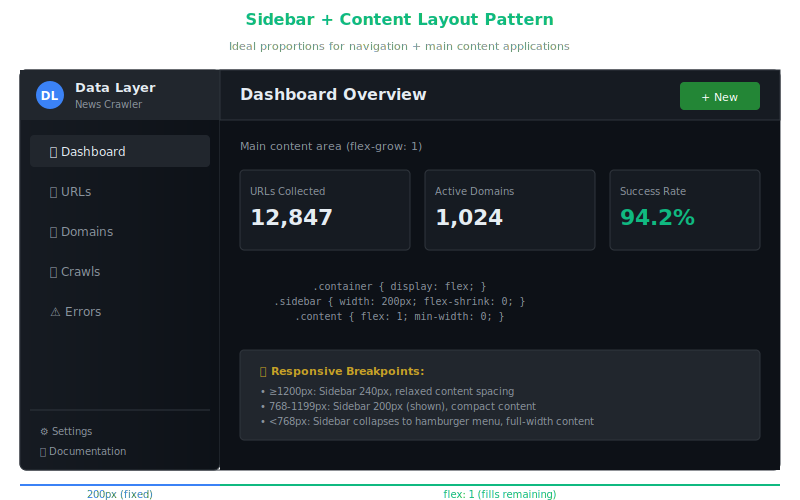
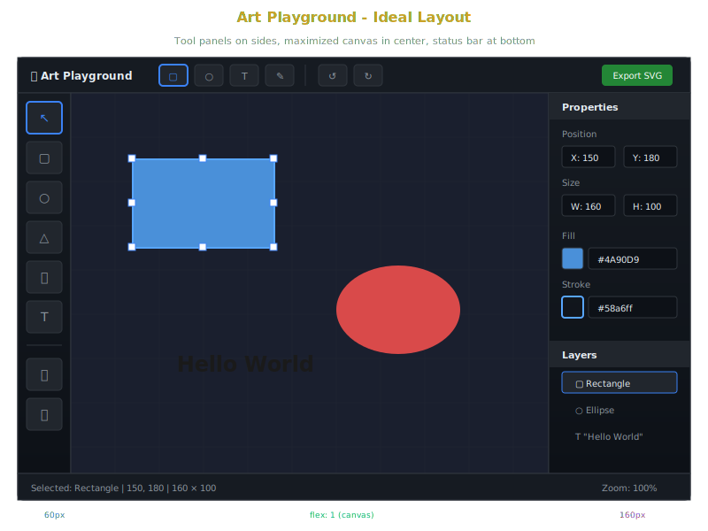

# Layout Improvement Workflow

> **Purpose**: A systematic approach to improving UI layouts in jsgui3 applications, using visual mockups and measurable criteria.

---

## The Core Principle

**Layout improvement is subjective unless we define clear targets.** This workflow uses SVG mockups to:

1. **Capture current state** — What does it look like now?
2. **Visualize the goal** — What should it look like?
3. **Communicate intent** — Human and AI agree on the target
4. **Measure success** — Did we achieve it?

---

## Workflow Overview

```
┌─────────────────────────────────────────────────────────────────────┐
│                    LAYOUT IMPROVEMENT CYCLE                         │
└─────────────────────────────────────────────────────────────────────┘

    ┌──────────────┐      ┌──────────────┐      ┌──────────────┐
    │   CAPTURE    │ ───▶ │   DESIGN     │ ───▶ │  IMPLEMENT   │
    │   BASELINE   │      │   TARGET     │      │   CHANGES    │
    └──────────────┘      └──────────────┘      └──────────────┘
           │                     │                     │
           ▼                     ▼                     ▼
    ┌──────────────┐      ┌──────────────┐      ┌──────────────┐
    │  Screenshot  │      │  SVG Mockup  │      │  CSS/HTML    │
    │  + Metrics   │      │  of Ideal    │      │  Adjustments │
    └──────────────┘      └──────────────┘      └──────────────┘
                                                       │
                                                       ▼
                                                ┌──────────────┐
                                                │   COMPARE    │
                                                │   & VERIFY   │
                                                └──────────────┘
```

---

## Phase 1: Capture Baseline

Before changing anything, document the current state:

```bash
# Screenshot the current layout
node scripts/ui/capture-<app>-screenshot.js --output screenshots/before-layout.png

# Measure HTML size and control count
node -e "
const { performance } = require('perf_hooks');
const start = performance.now();
// ... render your control
console.log('Render time:', performance.now() - start, 'ms');
console.log('HTML size:', html.length / 1024, 'KB');
"
```

---

## Phase 2: Design Target (SVG Mockups)

Create an SVG showing the **ideal layout**. This serves as:
- Visual specification for implementation
- Communication tool between human and AI
- Success criteria (does result match mockup?)

### Common Layout Patterns

Below are SVG templates for common layout improvements.

---

## Layout Pattern Library

### Pattern 1: Dashboard Grid Layout

**Problem**: Cards scattered, inconsistent spacing, poor hierarchy
**Solution**: CSS Grid with consistent gutters and visual grouping

| Before | After |
|--------|-------|
|  |  |

**Key Changes**:
- Consistent 16px gaps using `gap: 16px`
- Row-based card heights (cards in same row = same height)
- Color-coded accent bars for visual hierarchy
- Grid template: `repeat(auto-fit, minmax(180px, 1fr))`

```css
.dashboard-grid {
  display: grid;
  grid-template-columns: repeat(auto-fit, minmax(180px, 1fr));
  gap: 16px;
}

.card {
  background: linear-gradient(to bottom, #21262d, #161b22);
  border: 1px solid #30363d;
  border-radius: 6px;
}
```

---

### Pattern 2: Table Density Optimization

**Problem**: Too few rows visible, wasted column space, truncated URLs
**Solution**: Compact rows, smart column sizing, relative dates

| Before | After |
|--------|-------|
|  |  |

**Key Changes**:
- Row height: 40px → 32px (20% more rows visible)
- ID column: 80px → 25px (save space)
- Domain column: removed (already in URL)
- Date format: `2024-11-30` → `2d ago` (saves 40px)
- Status: Full text → Icon + 3-char abbreviation

**Result**: 4 rows → 8 rows visible above fold (100% improvement!)

```css
.table-row {
  height: 32px;
  line-height: 32px;
}

.col-id { width: 25px; }
.col-url { flex: 1; min-width: 0; } /* truncate with ellipsis */
.col-status { width: 50px; }
.col-when { width: 60px; }
```

---

### Pattern 3: Sidebar + Content Layout

**Problem**: Content area doesn't adapt, sidebar wrong size at breakpoints
**Solution**: Flexbox with fixed sidebar, fluid content



**Key Dimensions**:
| Breakpoint | Sidebar | Content |
|------------|---------|---------|
| ≥1200px | 240px | flex: 1 |
| 768-1199px | 200px | flex: 1 |
| <768px | collapsed (hamburger) | 100% |

```css
.app-container {
  display: flex;
  height: 100vh;
}

.sidebar {
  width: 200px;
  flex-shrink: 0;
  overflow-y: auto;
}

.content {
  flex: 1;
  min-width: 0; /* important: allows content to shrink */
  overflow-y: auto;
}

@media (max-width: 767px) {
  .sidebar { 
    position: fixed;
    transform: translateX(-100%);
  }
  .sidebar.open { transform: translateX(0); }
}
```

---

### Pattern 4: Art Playground Layout (Tool Panels)

**Problem**: Tools mixed with canvas, no clear workspace separation
**Solution**: Fixed tool panels on sides, maximized canvas center



**Key Layout**:
```
┌─────────────────────────────────────────────────┐
│              Top Toolbar (40px)                 │
├────────┬──────────────────────────┬─────────────┤
│ Tools  │                          │ Properties  │
│ (60px) │      Canvas (flex: 1)    │   (160px)   │
│        │                          │             │
├────────┴──────────────────────────┴─────────────┤
│              Status Bar (30px)                  │
└─────────────────────────────────────────────────┘
```

**CSS Structure**:
```css
.art-app {
  display: flex;
  flex-direction: column;
  height: 100vh;
}

.toolbar { height: 40px; flex-shrink: 0; }
.status-bar { height: 30px; flex-shrink: 0; }

.workspace {
  display: flex;
  flex: 1;
  min-height: 0;
}

.tool-panel { width: 60px; flex-shrink: 0; }
.canvas { flex: 1; min-width: 0; }
.properties-panel { width: 160px; flex-shrink: 0; }
```

---

## How to Use This Workflow

### For Humans

1. **Describe the problem**: "The dashboard cards are all different sizes"
2. **Pick a pattern**: Reference these SVGs as the target
3. **Define metrics**: "I want 8 cards visible at 1440px width"

### For AI Agents

When asked to "improve the layout", the agent should:

1. **Ask which pattern applies** (or infer from context)
2. **Reference the appropriate SVG** as the visual target
3. **Extract measurable criteria** from the diagram:
   - Spacing values (16px gaps)
   - Column widths (fixed vs flex)
   - Row heights (32px for compact tables)
4. **Implement CSS changes** to match the mockup
5. **Verify** with screenshots or HTML inspection

---

## Measuring Success

| Metric | How to Measure | Target |
|--------|----------------|--------|
| Rows visible | Count table rows above fold | 2x current |
| Spacing consistency | Measure all gaps | All equal |
| Control count | Walk jsgui3 `__ctrl_chain` | Reduce 30%+ |
| HTML size | `html.length / 1024` | Reduce 20%+ |
| Visual match | Side-by-side with mockup | 90%+ similarity |

---

## Adding New Patterns

When you discover a new layout improvement:

1. **Create before/after SVGs** in `layout-patterns/`
2. **Document the key changes** (CSS, dimensions)
3. **Add to this file** with the pattern template
4. **Test with real data** to verify the improvement

---

## Related Resources

- [OBSIDIAN_LUXURY_DESIGN_GUIDE.md](../guides/OBSIDIAN_LUXURY_DESIGN_GUIDE.md) — Color palette and visual language
- [JSGUI3_UI_ARCHITECTURE_GUIDE.md](../guides/JSGUI3_UI_ARCHITECTURE_GUIDE.md) — Control patterns
- [Performance Patterns](../../.github/agents/🧠%20jsgui3%20Research%20Singularity%20🧠.agent.md#-performance-patterns-critical) — Control count optimization

</content>
</invoke>